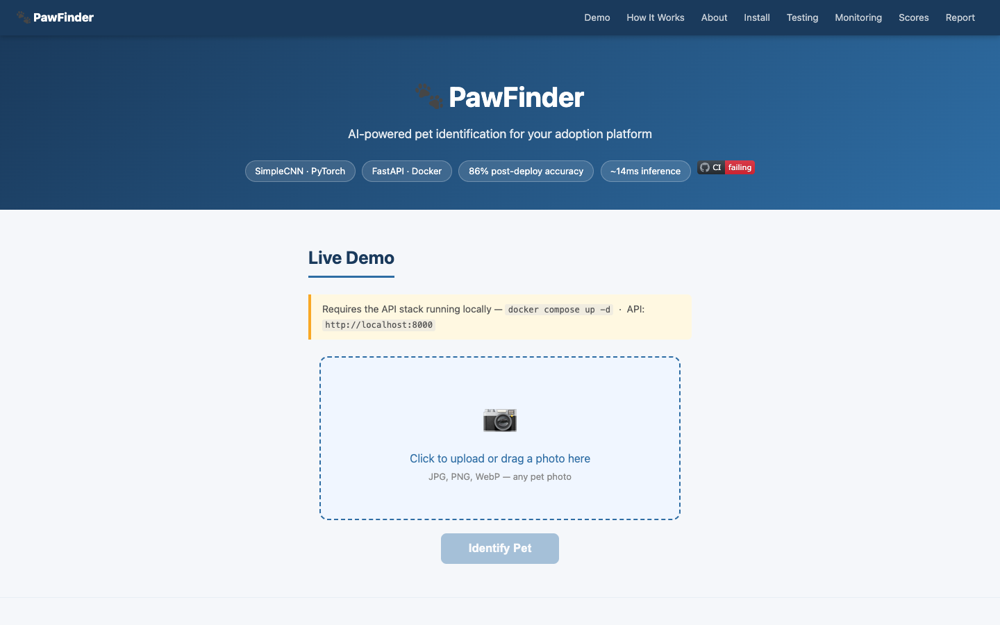

# 🐾 PawFinder — AI Pet Adoption Platform

**Student:** Sampath Kumar S Shetty | **ID:** 2024ac05041
**Course:** AIMLCZG523 — MLOps (S1-25) | **Institute:** BITS Pilani M.Tech AI/ML

[](https://github.com/sampathshetty85/cats-dogs-mlops/actions/workflows/ci.yml)

> **Live Demo:** https://sampathshetty85.github.io/cats-dogs-mlops/demo.html
> 
> **Demo Video:** https://youtu.be/SuxLDBvdej8

---

## Overview

**PawFinder** is an end-to-end MLOps pipeline that powers an AI pet identification service for adoption platforms. Upload a photo of a cat or dog and get an instant prediction with confidence score and latency.

Built with **PyTorch · FastAPI · DVC · MLflow · Docker · Kubernetes · Prometheus · Grafana**.



---

## Evaluator Quick-Start

No Kaggle credentials or local training required. The full stack comes up with one command:

```bash
git clone https://github.com/sampathshetty85/cats-dogs-mlops
cd cats-dogs-mlops
docker compose up -d
```

Wait ~30s for the API to be healthy, then test:

```bash
curl http://localhost:8000/health
curl -F "file=@tests/fixtures/sample_cat.jpg" http://localhost:8000/predict
```

Open the interactive demo:

```bash
open docs/demo.html
```

---

## Model Performance

| Metric | Value |
|--------|-------|
| Architecture | SimpleCNN (custom PyTorch, 3 conv blocks) |
| Training | 5 epochs, Adam lr=0.001, BCELoss |
| Validation accuracy | 82.7% |
| Post-deploy accuracy | **86.0%** (50 test images) |
| Precision (cat) | 84.6% |
| Recall (cat) | 88.0% |
| Avg inference latency | **~14 ms** |

---

## API Reference

| Endpoint | Method | Description |
|----------|--------|-------------|
| `/health` | GET | `{"status": "ok", "model": "SimpleCNN", "version": "1.0"}` |
| `/predict` | POST | Upload image → `{"label": "cat", "probability": 0.87, "inference_time_ms": 14.2}` |
| `/metrics` | GET | Prometheus metrics (request count, latency, prediction labels) |
| `/docs` | GET | Swagger UI — interactive API explorer |

---

## Monitoring

| Service | URL | Notes |
|---------|-----|-------|
| Grafana | http://localhost:3000 | admin / admin |
| Prometheus | http://localhost:9090/targets | Scrapes API every 15s |
| API Metrics | http://localhost:8000/metrics | Raw Prometheus text |
| MLflow | http://127.0.0.1:5001 | Run `mlflow ui --port 5001` |

---

## Pipeline

```
python src/data/download.py       # Kaggle → data/raw/  (25k images)
python src/data/preprocess.py     # resize 224×224, 80/10/10 split
python src/model/train.py         # SimpleCNN, 5 epochs, MLflow tracked
dvc add + dvc push                # version data and model
docker compose up -d              # evaluator: pull ghcr.io image + start stack
```

---

## Project Structure

```
cats-dogs-mlops/
├── src/
│   ├── config.py         # shared constants (MODEL_PATH, IMAGE_SIZE, etc.)
│   ├── data/             # download.py, preprocess.py
│   ├── model/            # architecture.py, train.py
│   └── api/              # main.py, schemas.py
├── tests/                # 7 pytest unit tests + fixtures
├── scripts/              # smoke_test.sh, batch_eval.py
├── monitoring/           # prometheus.yml, grafana dashboard
├── k8s/                  # deployment.yaml, service.yaml
├── docs/                 # demo.html, index.html, report.pdf
├── output/               # pipeline evidence reports (committed)
├── screenshots/          # training curves, confusion matrix
├── dvc.yaml              # pipeline: preprocess → train
├── Dockerfile
└── docker-compose.yml
```

---

## CI/CD

- **CI** — lint (flake8) + 7 unit tests + multi-arch Docker build + push to `ghcr.io` on every push to `main`
- **CD** — pull new image + `docker compose up` + smoke test on push to `main`

---

## Links

| Resource | URL |
|----------|-----|
| **PawFinder Demo** | https://sampathshetty85.github.io/cats-dogs-mlops/demo.html |
| **Demo Video** | https://youtu.be/SuxLDBvdej8 |
| GitHub | https://github.com/sampathshetty85/cats-dogs-mlops |
| Docker image | `ghcr.io/sampathshetty85/cats-dogs-mlops:latest` |
| GitHub Pages | https://sampathshetty85.github.io/cats-dogs-mlops/ |
| PDF Report | https://sampathshetty85.github.io/cats-dogs-mlops/report.pdf |
